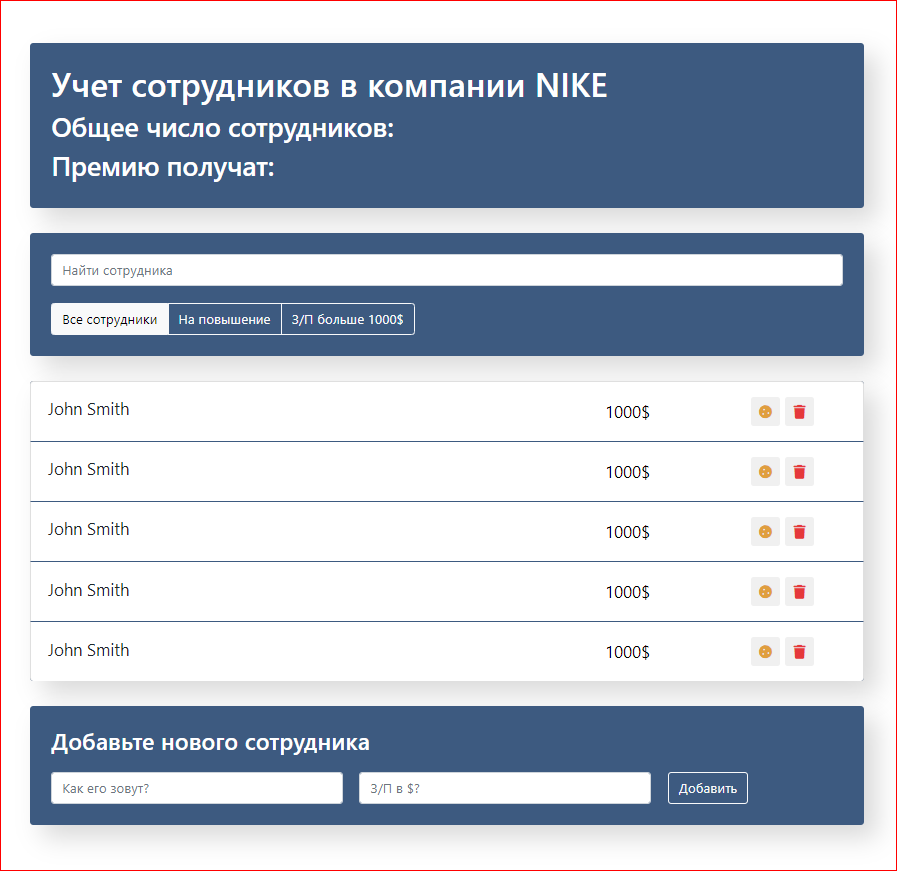

# Employees_template

Всем привет!

Это первый коммит приложения Employees template созданного мною при помощи React компонентов. Прежде, чем начать работу над ним, я изучила и закрепила на практике такие темы, как:

- Что такое реакт, зачем он нам и почему не обычный JS
- Фундаментальные принципы React
- Create React App - создаем свое приложение
- Работаем с JSX-препроцессором, ограничения в нем
- Элементы и компоненты
- Strict Mode и React 18+

На данном этапе оформлен лишь интерфейс приложения при помощи bootstrap классов. При последующей практике оно обрастет и функционалом.

***
